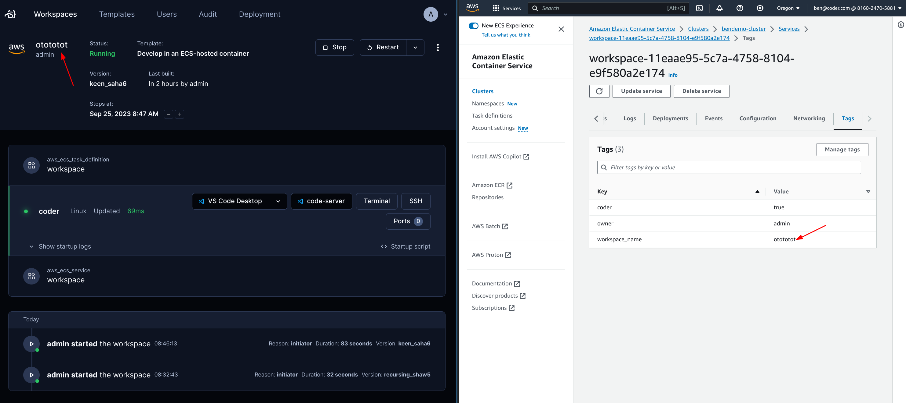

# Cloud Development with AWS Elastic Container Service (ECS)

Provision ECS containers as [Coder workspaces](https://coder.com/docs/coder-v2/latest) with this example template.

## Prerequisites

There are several prerequisites before you can import this template into your Coder deployment.

### Infrastructure

This template assumes you have already [created an ECS cluster](https://docs.aws.amazon.com/AmazonECS/latest/developerguide/ecs-tutorials.html) on your AWS account. When importing the template, you'll be prompted to enter the cluster ARN.

### Authentication

This template assumes you have AWS configuration and credentials stored in `/home/coder/.aws` on the server. To use another authentication method, edit the template to use a different [authentication method](https://registry.terraform.io/providers/hashicorp/aws/latest/docs#authentication-and-configuration).

## Architecture

> **Note**
> This template is designed to be a starting point! Edit the Terraform to extend the template to support your use case.

Each workspace using this template provisions the following resources:

- Task definition - the container definition, includes the image, command, volume(s)
  - Container: The container uses the `codercom/enterprise-base:ubuntu` image which includes several dev tools such as `curl` and `git`. Edit the image in the task definition or use a [parameter](https://coder.com/docs/v2/latest/templates/parameters) to give developers access to more tools.
  - Volume: A single persistent volume is mounted at `/home/coder`. Other files will not be persisted when the workspace is auto-stopped.
- ECS service - manages the task definition

## code-server

`code-server` is installed via the `startup_script` argument in the `coder_agent`
resource block. The `coder_app` resource is defined to access `code-server` through
the dashboard UI over `localhost:13337`.
