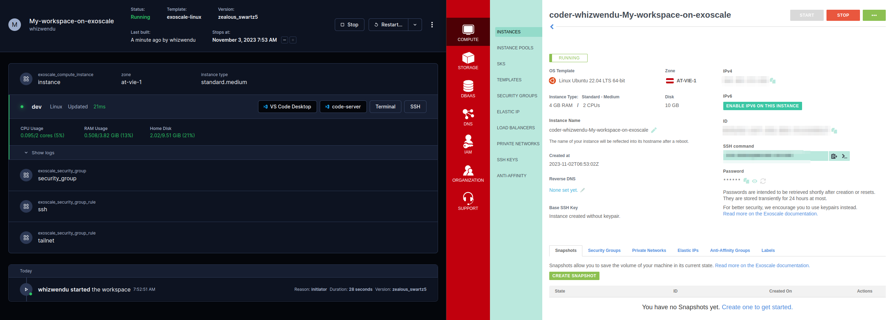
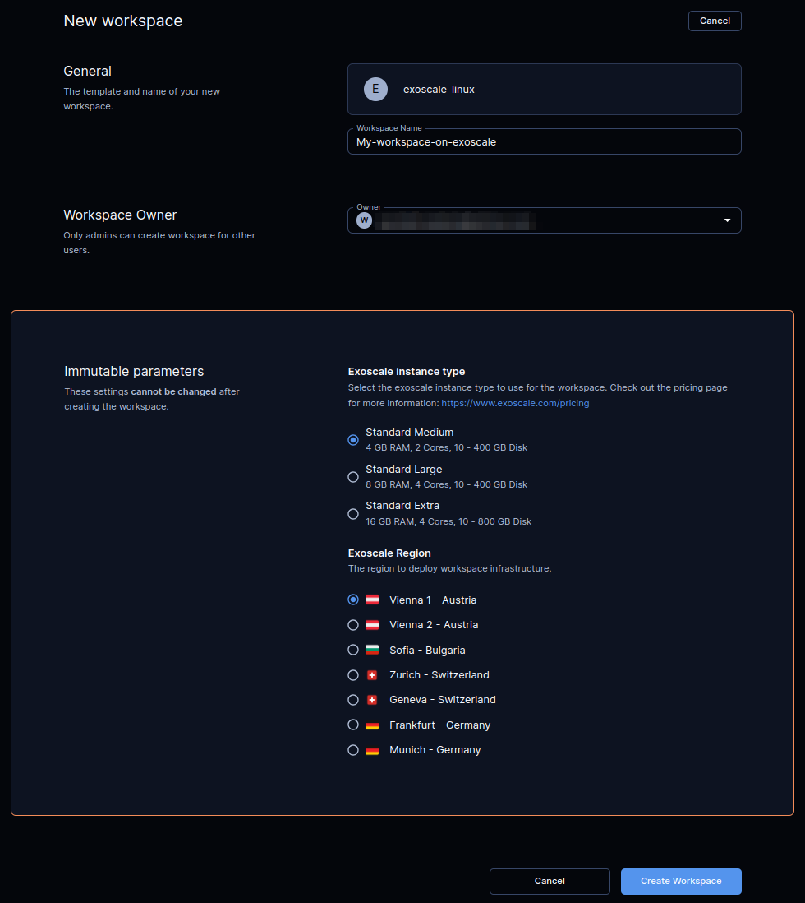

# Cloud Development with exoscale-linux

Provision exoscale-linux as [Coder workspaces](https://coder.com/docs/coder-v2/latest) with this example template.

## Prerequisites

There are few prerequisites before you can import this template into your Coder deployment.

### Infrastructure

You need to have an exoscale account.

### Authentication

### using env vars

You can set 2 environment variables at your coder server to connect to the exoscale api:

- `EXOSCALE_API_KEY`
- `EXOSCALE_API_SECRET`

You can create a key/secret pair in your [exoscale portal](https://portal.exoscale.com/)

### using terraform variables

- In the coder GUI you can go to the template settings -> variables and set key and secret there
- use a `.creds.yaml` in combination with the `--variables-file` flag
  - `coder template create  --variables-file .creds.yaml`

## Architecture

> **Note**
> This template is designed to be a starting point! Edit the Terraform to extend the template to support your use case.

This template provisions the following resources:
- Exoscale cloud standard instance with Ubuntu 22.04 and 10GB disk space
- Instance type can be selected in the template settings and uses the [exoscale-instance-type](https://registry.coder.com/modules/exoscale-instance-type) module
  - the instance types are reduced to only 3 types: medium, large and extra 
- Zone can be selected in the template settings and uses the [exoscale-zone](https://registry.coder.com/modules/exoscale-zone) module

### Pre install developer tools

- It is recommended to pre install [rtx](https://rtx.pub/) as an extension to this template, to give developers the possibility to install desired versions of node, python, java, ... see a list of available plugins [here](https://github.com/asdf-vm/asdf-plugins#plugin-list)

## code-server

`code-server` is installed via the [`code-serer`](https://registry.coder.com/modules/code-server) module. The `coder_app` resource is defined to access `code-server` through
the dashboard UI over `localhost:13337`.

