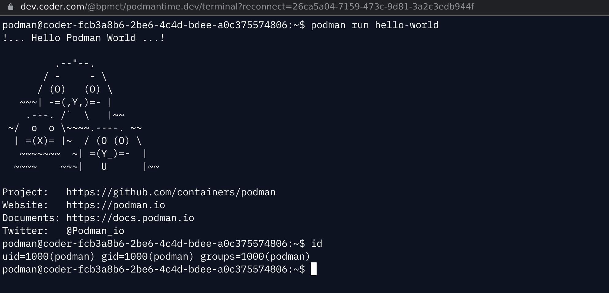

# Remote Development with Kubernetes+Podman

Provision Kubernetes Pods as [Coder workspaces](https://coder.com/docs/coder-v2/latest) with this example template.

## Prerequisites

### Infrastructure

**Cluster**: This template requires an existing Kubernetes cluster See [Shortcomings of Rootless Podman](https://github.com/containers/podman/blob/main/rootless.md) to see OS and Kernel requirements.

> **Note**
> The `smart-device-manager` plugin must also be installed on your cluster. See our [Rootless Podman Documentation](https://coder.com/docs/v2/latest/templates/docker-in-workspaces#rootless-podman) for more details.

**Container Image**: This template uses [custom image](https://github.com/coder/community-templates/tree/main/kubernetes-podman/images) with rootless podman configured. To add additional tools, extend this image or build it yourself.

### Authentication

This template authenticates using a `~/.kube/config`, if present on the server, or via built-in authentication if the Coder provisioner is running on Kubernetes with an authorized ServiceAccount. To use another [authentication method](https://registry.terraform.io/providers/hashicorp/kubernetes/latest/docs#authentication), edit the template.

## Architecture

> **Note**
> This template is designed to be a starting point! Edit the Terraform to extend the template to support your use case.

This template provisions the following resources:

- Kubernetes pod (ephemeral)
- Kubernetes persistent volume claim (persistent on `/home/coder`)

This means, when the workspace restarts, any tools or files outside of the home directory are not persisted. To pre-bake tools into the workspace (e.g. `python3`), modify the container image. Alternatively, individual developers can [personalize](https://coder.com/docs/v2/latest/dotfiles) their workspaces with dotfiles.
